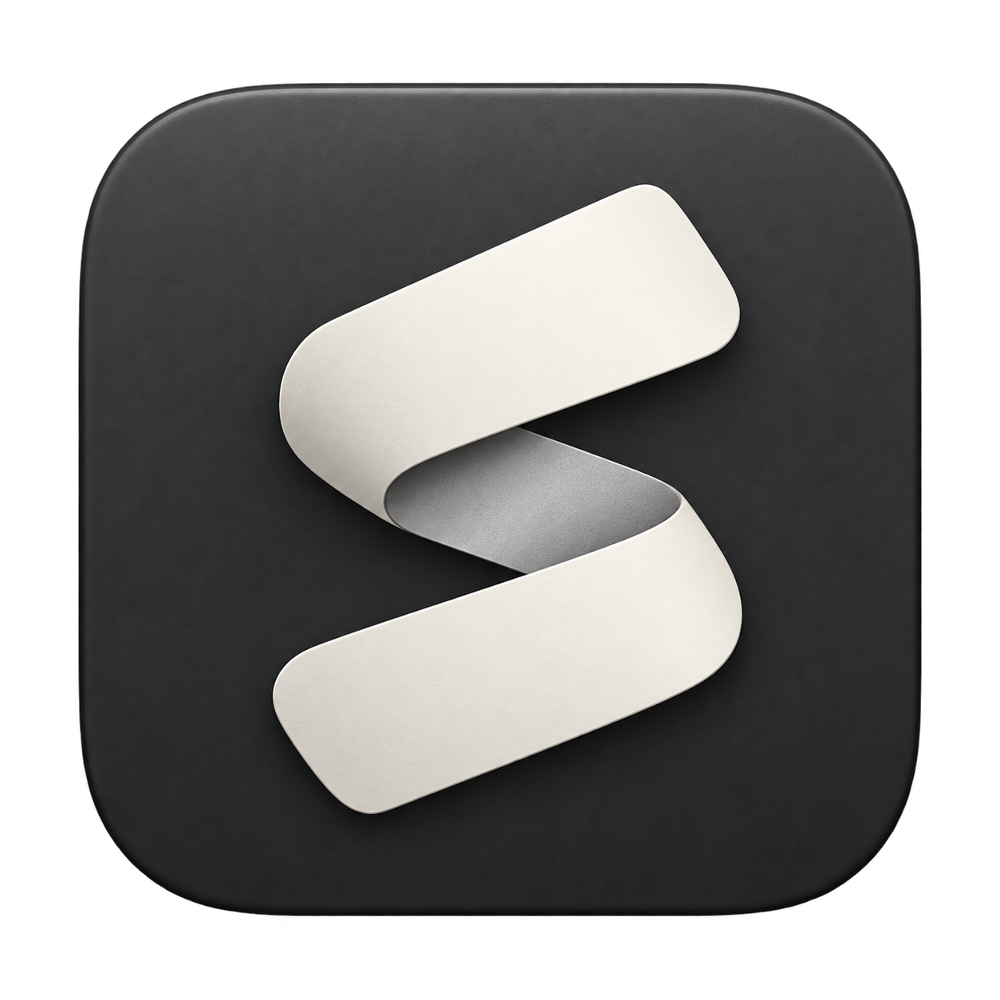

<p align="center">
  
</p>

# Still Notes

A quiet space for Markdown notes on **Windows**. Your notebook is a folder of ordinary `.md` files that you own, choose, and back up. No account, server, or cloud storage is required to write.

[**Download for Windows**](https://github.com/tsunsora/still-notes/releases/latest) · [Release notes](RELEASE-NOTES.md) · [Report an issue](https://github.com/tsunsora/still-notes/issues)

## At a glance

- **Plain Markdown:** write and preview headings, lists, tasks, links, quotes, code blocks, and tables.
- **Automatic saving:** saves after a short pause, before navigation, and before closing.
- **A familiar sidebar:** folders, drag-and-drop organization, note icons, and quick keyboard shortcuts.
- **Multiple notebooks:** switch between local folders, each with its own remembered session.
- **Pick up where you left off:** restores your window, sidebar, open note, reading position, and text selection.
- **A focused dark theme:** rounded Material icons and support for Windows reduced-motion preferences.

## Install and start writing

1. Open the [latest release](https://github.com/tsunsora/still-notes/releases/latest) and download the `Still-Notes-Setup-VERSION.exe` installer.
2. Run it, choose an installation location, and launch **Still Notes**.
3. Start in the automatically created **Documents/Still Notes** notebook, or use the folder button at the bottom of the sidebar to open an existing folder.

Windows builds are unsigned. The installer adds Start menu and desktop shortcuts. Notes remain separate from the application, and uninstalling retains your notes and app settings.

You can also build a portable copy using the [development instructions](#development). Run `Still Notes.exe` from the resulting `Still Notes-win32-x64` folder and keep its companion files beside it.

### Already using Still?

Still Notes is the new name for the same app. The installer upgrades existing installations and shortcuts while preserving the `%APPDATA%\Still` profile and `com.still.notes` Windows identity. Your notes stay in their existing folders.

## Everyday use

### Write and organize

- **Create:** right-click the sidebar, a folder, or a note to create in that location. `Ctrl+N` and `Ctrl+Shift+N` use the selected folder; click **Notes** above the tree to return to the root.
- **Rename or move:** edit a note's title, or use its three-dot menu. Deleting a note or folder sends it to the Windows Recycle Bin.
- **Read:** switch from **Write** to **Read** to preview Markdown. External links open in your browser; direct relative links to local Markdown notes open in the app. HTTPS images render when online.
- **Reorganize:** drag onto the middle of a folder to move inside it, between rows to reorder, or onto **Notes** to move to the root.
- **Import:** drag Markdown files from Windows Explorer onto a folder to import copies. The originals remain in place.
- **Customize:** use **Change icon** on a note, or **Use default icon** to reset it. Folder icons are fixed. Drag the sidebar edge to resize it; double-click to reset its width.

### Switch notebooks

Click the folder name at the bottom of the sidebar to choose a saved notebook or **Open another folder**. Pending edits save before switching, and each folder remembers its last note and sidebar state.

Use **× → Remove** to forget a saved folder, including one that is no longer available. This removes the list entry only; the folder and its notes remain on disk. Removing the active entry also closes that workspace.

### Keep your files safe

The top-right save status shows whether changes are on disk. **Refresh** reloads the tree and active note. If another app changes a note, Still Notes refuses to overwrite it: copy any unsaved text you want to keep, then choose **Reload from disk** in the note menu.

Notes live in your chosen folder. Appearance, organization, and session preferences live separately in Windows application data. Back up your notes folder as you would other documents.

An Obsidian vault can be opened as a folder, but Still Notes supports standard Markdown rather than Obsidian plugins, databases, canvases, or wiki-link extensions. Hidden configuration folders do not appear in the sidebar.

## Keyboard shortcuts

| Shortcut | Action |
| --- | --- |
| `Ctrl+N` | New note |
| `Ctrl+Shift+N` | New folder |
| `Ctrl+S` | Save now |
| `Ctrl+B` / `Ctrl+I` | Markdown bold / italic |
| `Ctrl+E` | Switch Write / Read |
| `Ctrl+\` | Show / hide sidebar |

## Session restore

Still Notes remembers window size, position, and maximized state, and moves the window onto an available display if a monitor is disconnected. It also restores sidebar width and visibility, Read/Write mode, and each notebook's expanded folders, selected folder, open note, scroll position, and text selection. Folder state follows renames and moves.

Session settings save as you work and before closing, switching notebooks, or restarting for an update.

## Updates

Public installers are available from [GitHub Releases](https://github.com/tsunsora/still-notes/releases/latest) without signing in. Run a newer installer to upgrade in place.

**Current updater limitation:** the 1.6.2 code still targets the old `tsunsora/still` repository name and requires GitHub authentication through its private-feed configuration, even though this repository is now public. GitHub redirects the old repository URL here. The app may still display a message referring to a private repository; manual downloads are the straightforward option if automatic updates fail.

For the existing automatic updater, sign in locally with `gh auth login --hostname github.com`, or supply a `GH_TOKEN` or `GITHUB_TOKEN` at launch with read access to the repository. Credentials stay in the main process and are not bundled with the app or update files. Writing notes does not require these credentials.

The installed app checks after launch and every four hours, downloads newer stable versions in the background, and applies a ready update silently when you close it. **Restart to update** applies it immediately and restores your session. Both paths save pending notes and preferences first; a failed save keeps your edits open. Failed checks retry with increasing delays, and **Check for updates** offers a manual retry.

Portable builds link to the installer. Development and automated test runs do not contact GitHub unless the optional live-feed check is explicitly run.

## Development

Use **Windows and Node.js 22** (the version used by CI). Still Notes is built with **Electron**, with Marked for Markdown rendering and DOMPurify for sanitization.

```sh
git clone https://github.com/tsunsora/still-notes.git
cd still-notes
npm ci
npm start
```

| Command | Result |
| --- | --- |
| `npm test` | Updater and session-state unit tests |
| `npm run package` | Portable app in `../Still-Windows/Still Notes-win32-x64` |
| `npm run installer` | Installer and update metadata in `../Still-Installer` |

### Additional checks

Run these on Windows with dependencies installed. Set `STILL_EXE` to a packaged executable when testing a build.

| Command | Coverage |
| --- | --- |
| `node tests/ui.cjs` | UI and save-before-update behavior |
| `node tests/session.cjs` | Session restoration across restarts |
| `node tests/repositories.cjs` | Notebook switching and removal |
| `node tests/folders.cjs` | Folder animation, icons, and reduced motion |
| `node tests/identity.cjs` | Reuse of the existing Still profile |
| `node tests/update-close.cjs` | Save handshakes before close/restart, using a simulated installer |
| `node tests/github-feed.cjs` | Optional live authentication/metadata check; requires `STILL_EXE` pointing to an installer-built executable and a local GitHub login |

The live-feed check never downloads or installs an update.

### Publish a release

1. Update the version in `package.json` and `package-lock.json`, and edit [RELEASE-NOTES.md](RELEASE-NOTES.md).
2. Push a matching `vVERSION` tag. The [Windows release workflow](.github/workflows/release.yml) checks the version, runs unit tests, builds the installer, and publishes a complete release through a draft.
3. For manual releases, run `npm run installer` and upload **all three** files together: `Still-Notes-Setup-VERSION.exe`, its `.exe.blockmap`, and `latest.yml`. Publish a stable release tagged `vVERSION`.

The update feed needs `latest.yml` and its installer checksum. Local builds do not publish automatically. The current updater feed configuration described above still applies to installer builds.

## Credits

The Still Notes logo was generated using GPT Image. Interface icons use Google's rounded Material icons under the Apache 2.0 license; the [license notice](src/MATERIAL-ICONS-LICENSE.txt) is included in the app.

## README counter

[](https://count.getloli.com/)

Powered by [Moe Counter](https://github.com/journey-ad/Moe-Counter). This counts image requests, not unique visitors; GitHub image caching can affect the total.
