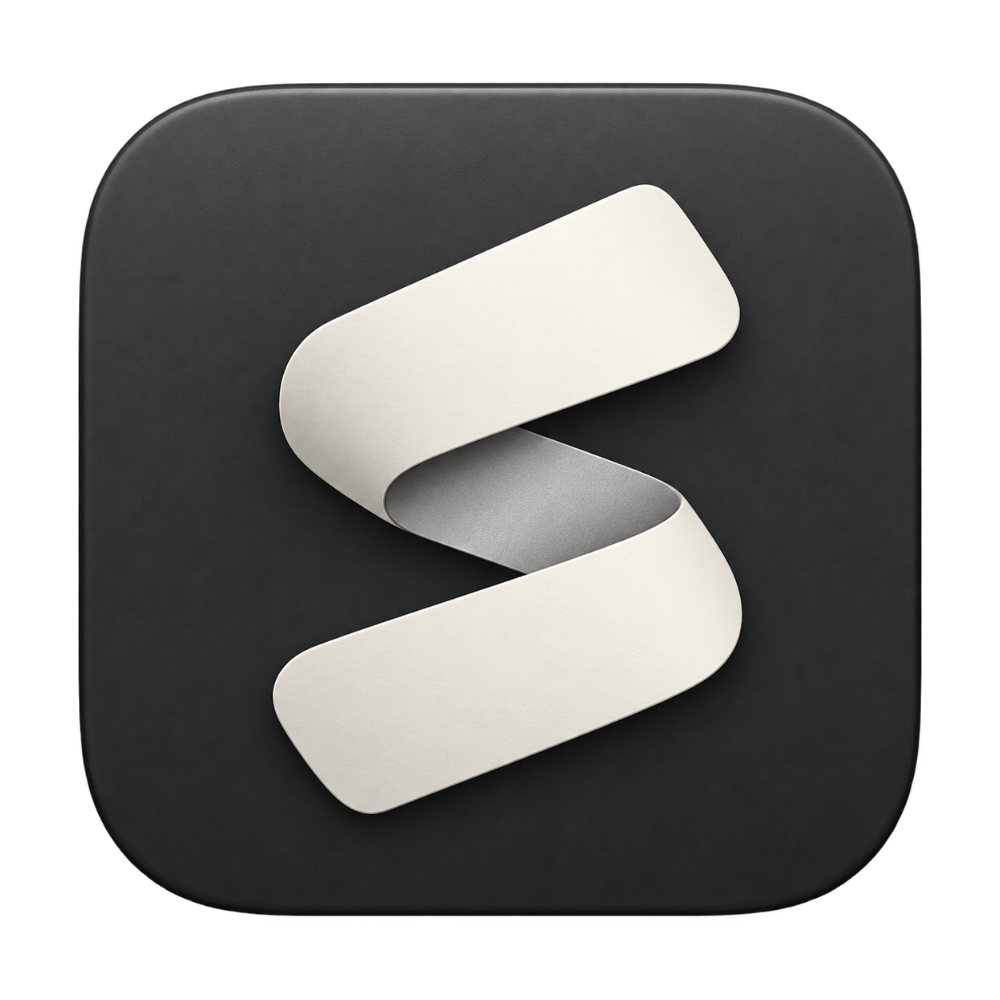

<p align="center">
  
</p>

# Still Notes

A quiet space for Markdown notes on **Windows**. Your notebook is a folder of ordinary `.md` files that you own, choose, and back up. No account, server, or cloud storage is required to write.

[**Download for Windows**](https://github.com/tsunsora/still-notes/releases/latest) · [Release notes](RELEASE-NOTES.md) · [Report an issue](https://github.com/tsunsora/still-notes/issues)

## At a glance

- **Plain Markdown:** write and preview headings, lists, tasks, links, quotes, code blocks, and tables.
- **Automatic saving:** saves after a short pause, before navigation, and before closing.
- **A familiar sidebar:** folders, drag-and-drop organization, note icons, and quick keyboard shortcuts.
- **Multiple notebooks:** switch between local folders, each with its own remembered session.
- **Pick up where you left off:** restores your window, sidebar, open note, reading position, and text selection.
- **A focused dark theme:** rounded Material icons and support for Windows reduced-motion preferences.

## Install and start writing

1. Open the [latest release](https://github.com/tsunsora/still-notes/releases/latest) and download the `Still-Notes-Setup-VERSION.exe` installer.
2. Run it, choose an installation location, and launch **Still Notes**.
3. Start in the automatically created **Documents/Still Notes** notebook, or use the folder button at the bottom of the sidebar to open an existing folder.

The installer adds Start menu and desktop shortcuts. Notes remain separate from the application, and uninstalling retains your notes and app settings. The release page identifies unsigned installers; these use manual updates. Automatic updates require a signed build.

You can also build a portable copy using the [development instructions](#development). Run `Still Notes.exe` from the resulting `Still Notes-win32-x64` folder and keep its companion files beside it.

### Already using Still?

Still Notes is the new name for the same app. The installer upgrades existing installations and shortcuts while preserving the `%APPDATA%\Still` profile and `com.still.notes` Windows identity. Your notes stay in their existing folders.

## Everyday use

### Write and organize

- **Create:** right-click the sidebar, a folder, or a note to create in that location. `Ctrl+N` and `Ctrl+Shift+N` use the selected folder; click **Notes** above the tree to return to the root. Names starting with a dot are rejected because those items would be hidden in the sidebar.
- **Rename or move:** edit a note's title, or use its three-dot menu. Deleting a note or folder sends it to the Windows Recycle Bin.
- **Read:** switch from **Write** to **Read** to preview Markdown. External links open in your browser; relative links such as `./Note.md` and `../Note.md` open notes within the notebook. HTTPS images render when online.
- **Reorganize:** drag onto the middle of a folder to move inside it, between rows to reorder, or onto **Notes** to move to the root.
- **Import:** drag Markdown files from Windows Explorer onto a folder to import copies. The originals remain in place.
- **Customize:** use **Change icon** on a note, or **Use default icon** to reset it. Folder icons are fixed. Drag the sidebar edge to resize it; double-click to reset its width.

### Switch notebooks

Click the folder name at the bottom of the sidebar to choose a saved notebook or **Open another folder**. Pending edits save before switching, and each folder remembers its last note and sidebar state.

Use **× → Remove** to forget a saved folder, including one that is no longer available. This removes the list entry only; the folder and its notes remain on disk. Removing the active entry also closes that workspace.

### Keep your files safe

The top-right save status shows whether changes are on disk. **Refresh** reloads the tree and active note. If another app changes a note, Still Notes refuses to overwrite it: copy any unsaved text you want to keep, then choose **Reload from disk** in the note menu.

During note loading, the editor and title are temporarily read-only. Launching Still Notes again brings the existing window forward instead of opening a second process using the same profile.

Each save preserves the previous disk revision in a `.still-recovery` folder beside the note. This also preserves edits made through a file handle another editor kept open during replacement. If a save is interrupted while the note path is absent, the next scan restores that disk revision. These copies are retained until you remove them manually and can grow over time. To recover a copy, move it to a separate folder and rename its `.bak` extension to `.md`.

Saving requires a filesystem that supports hard links, such as NTFS. Unsupported filesystems leave your edits in the app and restore the original note; use a supported notebook location.

Notes live in your chosen folder. Appearance, organization, and session preferences live separately in Windows application data. Back up your notes folder as you would other documents.

An Obsidian vault can be opened as a folder, but Still Notes supports standard Markdown rather than Obsidian plugins, databases, canvases, or wiki-link extensions. Hidden configuration folders do not appear in the sidebar.

## Keyboard shortcuts

| Shortcut | Action |
| --- | --- |
| `Ctrl+N` | New note |
| `Ctrl+Shift+N` | New folder |
| `Ctrl+S` | Save now |
| `Ctrl+B` / `Ctrl+I` | Markdown bold / italic |
| `Ctrl+E` | Switch Write / Read |
| `Ctrl+\` | Show / hide sidebar |

## Session restore

Still Notes remembers window size, position, and maximized state, and moves the window onto an available display if a monitor is disconnected. It also restores sidebar width and visibility, Read/Write mode, and each notebook's expanded folders, selected folder, open note, scroll position, and text selection. Folder state follows renames and moves.

Session settings save as you work and before closing, switching notebooks, or restarting for an update.

## Updates

Public installers are available from [GitHub Releases](https://github.com/tsunsora/still-notes/releases/latest) without signing in. Run a newer installer to upgrade in place.

Version 1.6.4 uses the public `tsunsora/still-notes` feed without GitHub authentication. Versions through 1.6.2 used the older authenticated feed; manually install a signed release if that updater cannot retrieve it.

Automatic updates require a trusted publisher in the installed build's update configuration. The downloaded installer must pass Windows publisher verification, which is repeated before installation. Builds without publisher metadata use manual updates from startup, without repeated warnings or background retries. Clicking the version number opens GitHub Releases to download a newer installer.

Signed installations check after launch and every four hours, download newer stable versions in the background, and apply a ready update silently when you close the app. The bottom of the sidebar displays the installed version number. Hover over it for update status; click it to check for updates or restart when an update is ready. Both installation paths save pending notes and preferences first; a failed save keeps your edits open. Failed network checks retry with increasing delays.

Portable builds link to the installer. Development and automated test runs do not contact GitHub unless the optional live-feed check is explicitly run.

## Development

Use **Windows and Node.js 22** (the version used by CI). Still Notes is built with **Electron**, with Marked for Markdown rendering and DOMPurify for sanitization.

```sh
git clone https://github.com/tsunsora/still-notes.git
cd still-notes
npm ci
npm start
```

| Command | Result |
| --- | --- |
| `npm test` | Updater, session-state, note storage, and relative-link unit tests |
| `npm run test:integration` | All UI and integration checks, including audit regressions |
| `npm run package` | Portable app in `../Still-Windows/Still Notes-win32-x64` |
| `npm run installer` | Signed installer and update metadata in `../Still-Installer`; requires signing credentials |

### Additional checks

Run these on Windows with dependencies installed. Set `STILL_EXE` to a packaged executable when testing a build.

| Command | Coverage |
| --- | --- |
| `node tests/regressions.cjs` | Navigation editing guards, relative links, root deletion guards, capitalization-only renames, hidden-name rejection, and single-instance behavior |
| `node tests/ui.cjs` | UI and save-before-update behavior |
| `node tests/session.cjs` | Session restoration across restarts |
| `node tests/repositories.cjs` | Notebook switching and removal |
| `node tests/folders.cjs` | Folder animation, icons, and reduced motion |
| `node tests/identity.cjs` | Reuse of the existing Still profile |
| `node tests/update-close.cjs` | Save handshakes before close/restart, using a simulated installer |
| `node tests/manual-updates.cjs` | Unsigned installed-build startup, quiet manual updates, and the GitHub Releases link |
| `node tests/github-feed.cjs` | Optional public-feed metadata check; requires `STILL_EXE` pointing to a signed installer-built executable |

The live-feed check never downloads or installs an update.

### Publish a release

1. Update the version in `package.json` and `package-lock.json`, and edit [RELEASE-NOTES.md](RELEASE-NOTES.md).
2. Configure `WIN_CSC_LINK` (a certificate path or base64 PFX) and `WIN_CSC_KEY_PASSWORD` repository secrets for a trusted Windows code-signing certificate. Local builds use the same environment variables. Do not commit the certificate or its password.
3. Push a matching `vVERSION` tag. The [Windows release workflow](.github/workflows/release.yml) checks the version, runs unit and integration tests, builds the signed installer, verifies both executable signatures and publisher metadata, and publishes a complete release through a draft. Missing signing credentials or invalid signatures stop publication.
4. For signed releases published manually, run `npm run installer` with signing credentials and upload **all three** files together: `Still-Notes-Setup-VERSION.exe`, its `.exe.blockmap`, and `latest.yml`. Publish a stable release tagged `vVERSION`.

The update feed needs `latest.yml`, its installer checksum, and publisher metadata embedded in the installed app. Default installer builds enforce `forceCodeSigning`. Local builds do not publish automatically. Portable development builds can be created without signing and do not enable automatic updates.

For an unsigned manual-install release, explicitly build with `npm run installer -- --config.forceCodeSigning=false`, verify the packaged app, and publish the installer with a SHA-256 checksum file. Identify the installer as unsigned in the release notes and omit `latest.yml` and `.exe.blockmap`; unsigned releases must not enter the automatic update feed. Publisher verification remains enabled, and the app uses the GitHub Releases link for manual updates.

## Credits

The Still Notes logo was generated using GPT Image. Interface icons use Google's rounded Material icons under the Apache 2.0 license; the [license notice](src/MATERIAL-ICONS-LICENSE.txt) is included in the app.

## Visitors

[](https://count.getloli.com/)

Powered by [Moe Counter](https://github.com/journey-ad/Moe-Counter). This counts image requests, not unique visitors; GitHub image caching can affect the total.
